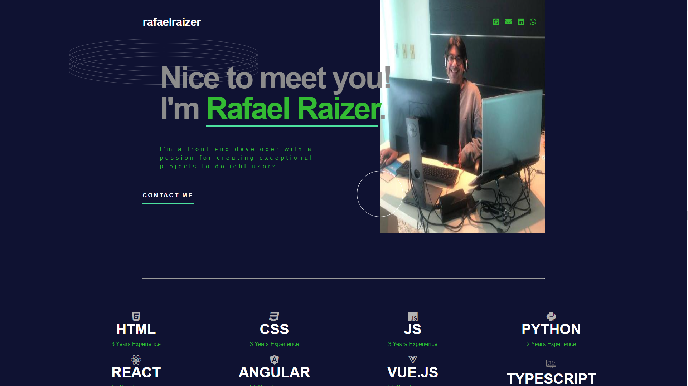

# MODULO PROJETO FRONT-END HTML FINAL

 <div align="center">
 

[ ( Clique aqui e venha explorar => ```A look at my portfolio!!!``` ) ]("https://portfoliotech-rafarz76dev.vercel.app/" target="_blank" title="Linkedin")

<br>

<div align="center">
  
 [Demonstração-Portfolio_RafaRz76Dev] 

 


***
<div align="left">  

Instruções do Desafio:

- Criação de um portifólio criado nas aulas do modulo de Front End em HTML E CSS e explorar diferentes tipos de elementos.
- Construir esse portfólio de página única e fazer com que pareça o mais próximo possível do design.
- Que receba uma mensagem de erro quando o formulário for enviado se: Qualquer campo está vazio O endereço de e-mail não está formatado corretamente.
- Veja o layout ideal para a interface dependendo do tamanho da tela do dispositivo.
- Veja os estados de foco e foco de todos os elementos interativos na página.
- Bônus: conecte o formulário para enviar e armazenar a consulta do usuário (você pode usar uma planilha ou Airtable para salvar as consultas).
- Bônus: adicione seus próprios detalhes (imagem, habilidades, projetos) para substituir os do design.

- LinkPortfolio-FronEndMentor](https://www.frontendmentor.io/challenges/singlepage-developer-portfolio-bBVj2ZPi-x)

<div align="left">

<br>

***

 Tecnologias utilizadas no projeto:

🎯 HTML
🎯 CSS 
🎯 JAVASCRIPT

<br>

***

  Ferramenta utilizada no projeto:

- [VsCode](https://code.visualstudio.com/download) (v1.80.1)

<br>

***

 Para rodar no `Front-End`:
- No arquivo `index.html` vai clicar com o botão direito para digitar:
```
Open With Live Server
```
- Assim vai abrir no navegador a `PORTFOLIO-RAFARZ76DEV!`.

***

- Ou pelo `Deplopy Netlify`:
  
[ ( Clique aqui e venha explorar ```A Look at My Portfolio!!!```) ](https://portfoliotech-rafarz76dev.vercel.app/)
    
<br>

***
 Autor

<p>
    
    <p>&nbsp&nbsp&nbspRafaRz76Dev<br>
    &nbsp&nbsp&nbsp<a href="https://api.whatsapp.com/send/?phone=47999327137">Whatsapp</a>&nbsp;|&nbsp;<a href="https://www.linkedin.com/in/rafael-raizer//">LinkedIn</a>&nbsp;|&nbsp;<a href="https://github.com/RafaRz76Dev">GitHub</a>|&nbsp;<a href="https://public.tableau.com/app/profile/rafael.raizer">Tableau</a>|&nbsp;<a href="https://portifolio-rafarz76dev.netlify.app/">Portfólio</a>&nbsp;</p>
</p>

